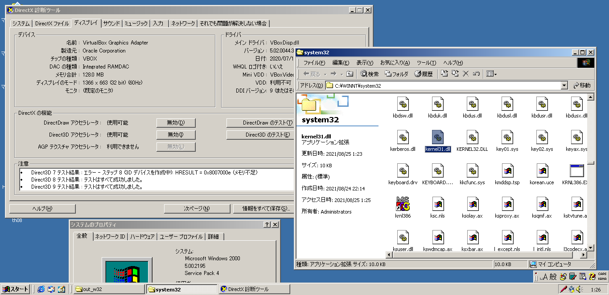
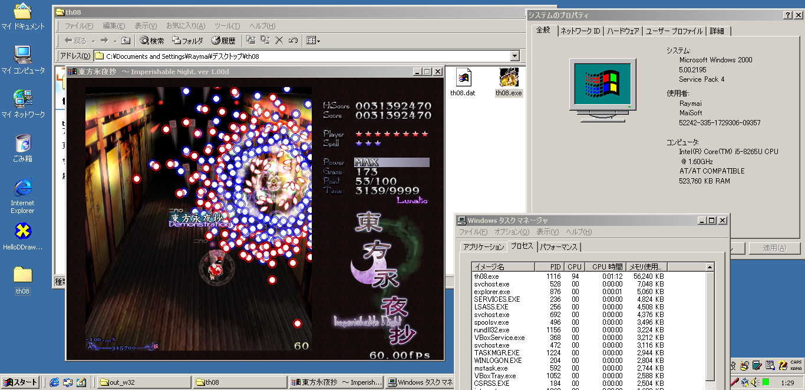

# vbox-d3d-on-w2k
VirtualBox Direct3D support for Windows 2000

For more info, please read:
https://raymai97.github.io/myblog/enable-direct3d-in-win2k-vbox

This repo currently contains code and release for:
* VirtualBox 5.2.44 r139111 - tested with Windows 2000 SP4
